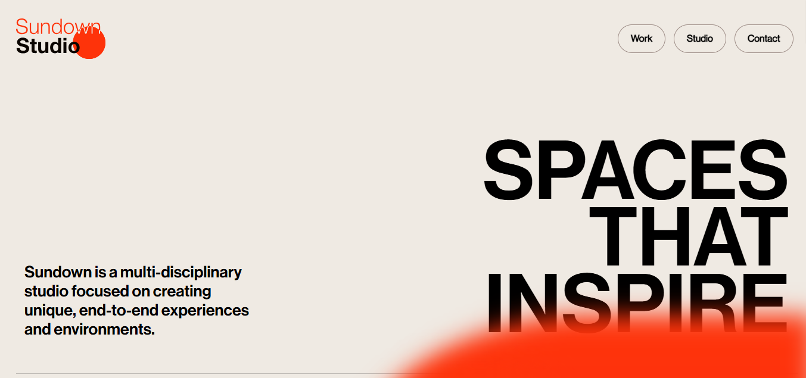

<div align="center">

<sub>Dev-Chandan404 / Sundown-Studio</sub>

# 🌅 Sundown Studio — Creative Studio Website 🌅

### *Immersive Design. Smooth Motion. Studio-Grade Experience.*

<br/>

[](https://dev-chandan404.github.io/Sundown-Studio/)
[](https://github.com/Dev-Chandan404/Sundown-Studio)
[](https://github.com/Dev-Chandan404/Sundown-Studio/issues)

<br/>

[](https://developer.mozilla.org/en-US/docs/Web/HTML)
[](https://developer.mozilla.org/en-US/docs/Web/CSS)
[](https://developer.mozilla.org/en-US/docs/Web/JavaScript)
[](https://pages.github.com/)
[](LICENSE)

<br/>

[](https://github.com/Dev-Chandan404/Sundown-Studio/commits)
[](https://github.com/Dev-Chandan404/Sundown-Studio)
[](https://github.com/Dev-Chandan404/Sundown-Studio/stargazers)

<br/>

<a href="https://dev-chandan404.github.io/Sundown-Studio/">
  
</a>

*Sundown Studio — A visually immersive creative studio experience built with pure HTML, CSS & JS*

</div>

---

## ✨ About the Project

> A **modern, visually immersive creative studio website** inspired by award-winning studio UIs. Built with pure HTML, CSS, and JavaScript — featuring a cinematic video background, smooth scrolling sections, and polished hover interactions that deliver a true studio-grade web experience.

This project demonstrates how **expressive CSS**, **thoughtful layout design**, and **subtle JavaScript interactions** can combine to create something that feels like it belongs on the world stage — no framework required.

---

## 🎯 Key Features

| | Feature | Description |
|---|---|---|
| 🎬 | **Video Background** | Cinematic full-screen video for an immersive first impression |
| 🖱️ | **Smooth Scrolling** | Silky scroll transitions between sections |
| ✨ | **Hover Interactions** | Polished micro-animations on interactive elements |
| 🎨 | **Modern Design Aesthetic** | Clean, minimal studio-inspired visual language |
| 📱 | **Responsive Layout** | Adapts beautifully across all screen sizes |
| ⚡ | **Zero Dependencies** | Pure vanilla stack — no npm, no build tools, no bloat |

---

## 🛠️ Built With

<div align="center">

| HTML5 | CSS3 | JavaScript |
|-------|------|------------|
|  |  |  |

</div>

---

## 📂 Website Sections

| Section | Description |
|---------|-------------|
| 🌅 **Hero** | Full-screen video background with bold studio headline |
| 🎨 **About** | Studio story and creative philosophy |
| 🚀 **Work / Projects** | Curated project showcase with hover effects |
| 🛠️ **Services** | What the studio offers with clean layout |
| 📬 **Contact** | Minimal, elegant get-in-touch section |

---

## 🚀 Getting Started

No installation. No build step. Just clone and open.

```bash
# Clone the repo
git clone https://github.com/Dev-Chandan404/Sundown-Studio.git
cd Sundown-Studio

# Open directly in your browser
open index.html

# Or serve locally
npx serve .
# → http://localhost:3000
```

---

## 📁 Project Structure

```
Sundown-Studio/
├── 📂 css/             # Stylesheets and layout
├── 📂 images/          # Static image assets
├── 📂 script/          # JavaScript interaction logic
├── index.html          # Main entry point
├── video.mp4           # Cinematic hero background video
├── icon.png            # Site favicon
└── README.md
```

---

## 🔭 Roadmap & Possible Extensions

- [ ] Add GSAP scroll-triggered animations for richer motion
- [ ] Introduce a custom cursor for premium studio feel
- [ ] Add a preloader / intro animation sequence
- [ ] Implement a dark / light mode toggle
- [ ] Convert to React or Next.js with component architecture
- [ ] Connect contact form to a backend or email service

---

<div align="center">

## 📄 License

Distributed under the **MIT License**. See `LICENSE` for more information.

<br/>

✨ **Let's Connect** ✨

[](mailto:dev.chandankumar404@gmail.com)
[](https://github.com/Dev-Chandan404)
[](https://chandan404.netlify.app/)

<br/>

⭐ **If you like this project, please give it a star!** ⭐

*Made with ❤️ by **Chandan Kumar***

</div>
